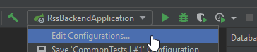
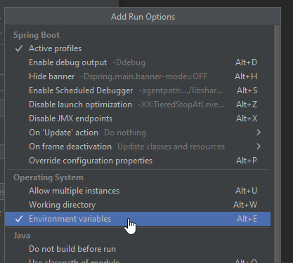
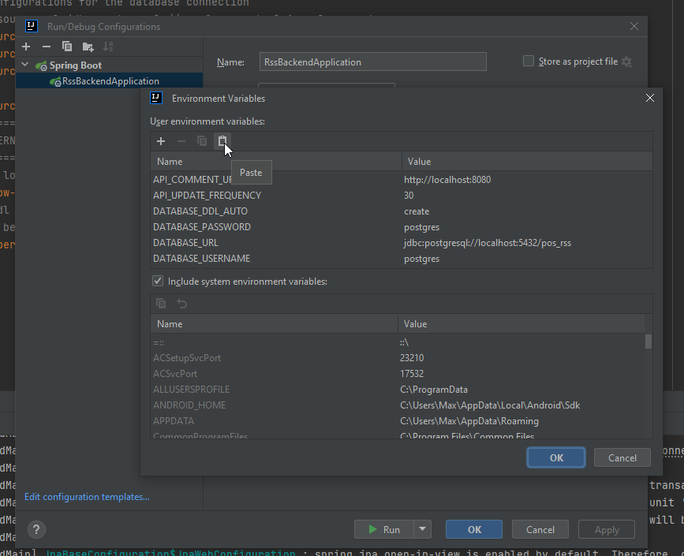

# Run it locally
To run this backend locally, clone it to your pc and open it with Intellij or any other IDE.

The fastest way would be to import the environment variables to your Intellij run configuration and change the database credentials if needed and create the `rss_pos` db.

- Open the project in Intellij and run the [RssBackendApplication](/src/main/java/at/kaindorf/rssbackend/RssBackendApplication.java). The application will crash.
- Now, edit the run configurations 
- Then click on `Modify Options` and enable environment variables 
- Lastly, you will see a field for the environment variables. Click the icon on the right to edit the environment variables and paste them there. 

```env
API_COMMENT_URL=http://localhost:8080;API_UPDATE_FREQUENCY=30;DATABASE_DDL_AUTO=create;DATABASE_PASSWORD=postgres;DATABASE_URL=jdbc:postgresql://localhost:5432/pos_rss;DATABASE_USERNAME=postgres
```

Alternatively, you can configure all of this yourself:
Navigate to the [application.properties](src/main/resources/application.properties) file and either replace all the environment variables with hard coded value or set these environment variables yourself.
You will also have to set the API_COMMENT_URL defined in the [UserCommentInitializer.java](src/main/java/at/kaindorf/rssbackend/db/UserCommentInitializer.java) to any value.
The last value API_UPDATE_FREQUENCY used in [RssUpdater.java](src/main/java/at/kaindorf/rssbackend/db/RssUpdater.java) will have to be set to any number in seconds (preferrably 30 seconds)

# RSS Backend
--------

Hello People! 
This is the Backend repo for "RSS".
It's really sophisticated!
-------

## Really Sophisticated Story Feed

DB Name: 
